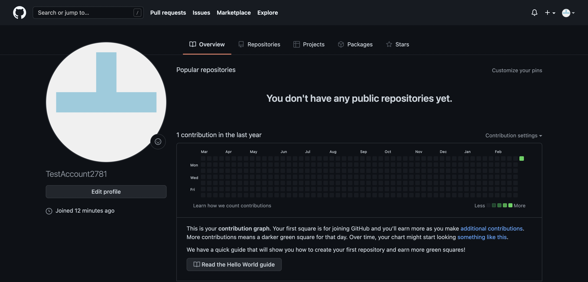

# Getting started with GitHub

## Introduction to GitHub

GitHub is renowned in the Software Development industry as a tool used by developers for building projects, storing information and collaboration. At it's core, GitHub is a website where project code is stored but investigating it further can uncover it's true capabilities.

Getting started with GitHub may seem like a daunting task and wrapping your head around terms such as "Repositories", "Pull and Push Requests", and "Branches" can take some time but once the fundamentals are understood it's uses can be uncovered pretty quickly.

In this brief introduction to GitHub we will run through your GitHub Profile, creating a Repository and uploading some files to it too.

## First logging on to GitHub.com -

Once you create your account and log in for the first time your profile by default will display popular repositories, your contributions and your contribution activity. Your profile is a great way of demonstrating these contributions and displaying the projects you are involved in.

### **What is a Repository? -**

A repository is a central file storage location and is used to store multiple versions of files throughout a project. It can be stored on the cloud so multiple people in a project can gain access to the files, start working on them and eventually re-upload their changes without impacting the originals.

We will go into detail about this process further down.

### **Creating your first repository -**

Select the repositories tab on your profile and select the 'New' button.

When this option is selected, it will open a page that will allow you to fill in the initial details of the project.

From this page, you will need to name your project as a requirement. You also have the option of giving it a description and other options to initialize your repository with. We will be uploading a README.md in our first commit and do not need a .gitignore or a license at this point.

Once this page is complete we can select create repository!

## **Initial repository page -**

Once the repository has been created GitHub will provide instructions on how to set it up so it is ready for use.

## **Your Project Files -**

When you have your project files opened in you IDE we can begin to track them using git and get them published to the repository we have just created.

We can begin tracking a project we want to upload to the repository by typing the following command into a terminal with the project folder you have selected:

    git init

The terminal will confirm that the project is now being tracked using git and has initialized an empty repository. From this point onwards git will track any changes to files in the project folder we have selected.

We will also need to add a .gitignore file to our project. Without going into too much detail, the .gitignore file prevents certain files from being uploaded to the repository. This may be for security reasons or some files may simply not be required.

At all stages of the process, we can check what files are ready to be uploaded by using the following command:

    git status 

git status will display our branch, commits, and tracked files.

As we can see here, the untracked files are in red. We want to add these files to the 'staging area' which means they are prepared for upload.

We add these files by using git add. At this initial stage we can use the following command to included all files in the folder.

    git add -A

git status then confirms the desired files have been added.

Once these steps have been completed, we are ready to do initiate the first commit.

## **git commits -**

A commit is aimed at keeping track of the projects progress and the work that has been completed so far. If something was wrong at any stage of the project, git commits allow us to return to a point where we knew the project was functional.

We always add a comment to our commits with a bit of information detailing what has been completed.

Seeing as this is the first commit we will use that as our comment.

    git commit -m "first commit"

We also want to ensure that our first commit points to the main branch. By default, the first branch of a GitHub repository is always the main branch. Use the following command to ensure the commit will sent to the main branch.  

    git branch -M main

An important part of the process is to point git to GitHub. Git will not automatically know where we are trying to send our files and we require them to be uploaded to the repository we created earlier.

The link can be found on GitHub within our project:

We can then set the git remote by using the following command and inserting our link.

    git remote add origin https://github.com/TestAccount2781/test-project.git

Once our commit is ready, we can push to our repository on GitHub using the following command:

    git push -u origin main

Our terminal will confirm if files have been uploaded to the repository and if we are successful we can check GitHub for our files.

Our files have been successfully uploaded to the repository!

## **Branches -**

As mentioned previously, the first branch GitHub creates is the main. Once we have completed an initial upload, it's important that branches are created so progress can be tracked in stages.

Creating a new branch is straight forward and can completed by using the git checkout command:

    git checkout -b <your-new-branch-name>

Additional changes to the file will be tracked on this branch and once you are happy they are ready to be committed use the following command to push your new branch to the project.

    git push origin <your-new-branch-name>

Once the second branch has been pushed to the repository, a pull request will be completed which will merge the branch to the main and update the project successfully.

## **Pull Requests -**

A pull request is aimed at keeping track of a project and ensuring that changes to the project code are introduced without overwriting previous information.

When a new branch is pushed to the repository, a pull request will be created and  if there are no conflicts with the code the branch will be merged into the main.

GitHub will advise that the merge has been successful and the main branch has been updated.

## **Summary**

Getting up and running with GitHub can be a little challenging for the first while but it's uses once you are familiar with it can benefit your projects greatly. GitHub can also be an integral part of a collaborative project when multiple people are working with the same code.
