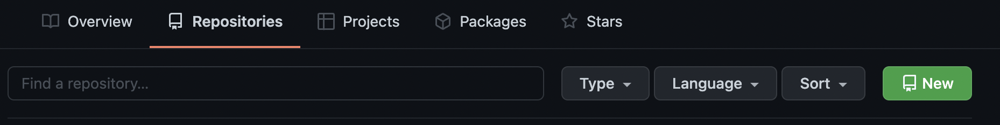

# Getting started with GitHub

## Introduction to GitHub

GitHub is renowned in the Software Development industry as a tool used by developers for building projects and storing information. It is also a very useful tool for collaboration. At it's core, GitHub is a website where project code is stored but investigating it further can uncover it's true capabilities.

Getting started with GitHub may seem like a daunting task and wrapping your head around terms such a as "Pull and Push Requests", "Repositories" and "Main Branch" can take some time but once the fundamentals are understood it's uses can be uncovered pretty quickly.

In this brief introduction to GitHub we will run through your GitHub Profile, creating a Repository and uploading some files to it too.

## First logging on into GitHub.com -

Once you create your account and log in for the first time your profile by default will display  popular repositories, your contributions and your contribution activity.

### **What is a Repository? -**

A repository is a central file storage location and is used to store multiple versions of files throughout a project. It can be stored on the cloud so multiple people in a project can gain access to the files, start working on them and eventually re-upload their changes without changing the originals.

We will go into detail about this process further down.

### **Creating your first repository -**

Select the repositories tab on your profile and select the 'New' button.

When this option is selected, it will open a page that will allow us to fill in the initial details of the project.

From this page, you will need to name your project as a requirement. You also have the option of giving it a description and other options to initialize your repository with. We will be uploading a README.md in our first commit and do not need a .gitignore or a license at this point.

Once this page is complete we can select create repository!

### **Initial repository page -**

Once the repository has been created GitHub will provide instructions on how to set it up so it is ready for our first use.

### **Your Project Files -**

When you have your project files opened in you IDE we can begin to track them using git and get them published to the repository we have just created.

We can begin tracking a project we want to upload to the repository by typing the following command into your terminal:

    git init

The terminal will confirm that the project is now being tracked using git and has initialized an empty repository. From this point onwards git will track any changes to files in the project folder we have selected.

We will also need to add a .gitignore file to our project. Without going into too much detail, the .gitignore file prevent certain files from being uploaded to the repository. This may be for security reasons or some files may simply not be required.

At all stages of the process, we can check what files are ready to be uploaded using the following command:

    git status 

git staus will display our branch, commits, and tracked files.

We can then add these files by using git add. At this initial stage we can use the following comman  to included all files in the folder.

    git add -A
